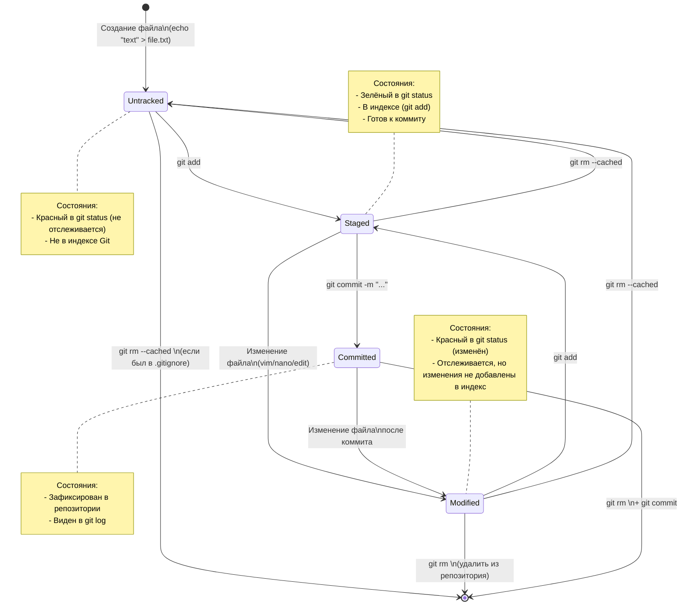

# **Проект-помощник — самая удобная шпаргалка по работе с Git**   

## Установка Git

GitHub предоставляет оконное приложение с графическим интерфейсом для выполнения основных операций с репозиторием, и консольную версию Git с автоматическими обновлениями для расширенных сценариев работы.


[GitHub Desktop](https://desktop.github.com)

Дистрибутивы Git для систем Linux и POSIX доступны на официальном сайте Git SCM.


[Git для всех платформ](https://git-scm.com)
## Первоначальная настройка

* Настройка информации о пользователе для всех локальных репозиториев

```bash  
git config --global user.name "[имя]" 
```   
Устанавливает имя, которое будет отображаться в поле автора у выполняемых вами коммитов

```bash  
git config --global user.email "[адрес электронной почты]"  
```

* Устанавливает адрес электронной почты, который будет отображаться в информации о выполняемых вами коммитах
##Создание репозитория

* Создание нового репозитория или получение его по существующему URL-адресу

```bash
git init [название проекта]
```

* Создаёт новый локальный репозиторий с заданным именем

```bash
git clone [url-адрес]
```

* Скачивает репозиторий вместе со всей его историей изменений
##Внесение изменений

* Просмотр изменений и создание коммитов (фиксация изменений)
```bash 
git status
```
* Перечисляет все новые или изменённые файлы, которые нуждаются в фиксации
```bash 
git diff
```
* Показывает различия по внесённым изменениям в ещё не проиндексированных файлах
```bash 
 git add [файл]
```
* Индексирует указанный файл для последующего коммита
```bash 
 git diff --staged
```
* Показывает различия между проиндексированной и последней зафиксированной версиями файлов
```bash 
git reset [файл]
```
* Отменяет индексацию указанного файла, при этом сохраняет его содержимое
```bash 
git commit -m "[сообщение с описанием]"
```
* Фиксирует проиндексированные изменения и сохраняет их в историю версий
## Коллективная работа

Именованные серии коммитов и соединение результатов работы
```bash 
git branch
```
Список именованных веток коммитов с указанием выбранной ветки
```bash 
git branch [имя ветки]
```
Создаёт новую ветку
```bash 
 git switch -c [имя ветки]
```
Переключается на выбранную ветку и обновляет рабочую директорию до её состояния
```bash 
git merge [имя ветки]
```
Вносит изменения указанной ветки в текущую ветку
```bash 
git branch -d [имя ветки]
```
Удаляет выбранную ветку
## Операции с файлами

Перемещение и удаление версий файлов репозитория
```bash 
git rm [файл]
```
Удаляет конкретный файл из рабочей директории и индексирует его удаление
```bash 
 git rm --cached [файл]
```
Убирает конкретный файл из контроля версий, но физически оставляет его на своём месте
```bash 
git mv [оригинальный файл] [новое имя]
```
Перемещает и переименовывает указанный файл, сразу индексируя его для последующего коммита
Игнорирование некоторых файлов

Исключение временных и вторичных файлов и директорий
```bash 
*.log
build/
temp-*
```
Git будет игнорировать файлы и директории, перечисленные в файле .gitignore с помощью wildcard синтаксиса
```bash 
 git ls-files --others --ignored --exclude-standard
```
Список всех игнорируемых файлов в текущем проекте
## Сохранение фрагментов

Сохранение и восстановление незавершённых изменений
```bash 
 git stash
```
Временно сохраняет все незафиксированные изменения отслеживаемых файлов
```bash 
 git stash pop
```
Восстанавливает состояние ранее сохранённых версий файлов
```bash 
 git stash list
```
Выводит список всех временных сохранений
```bash 
 git stash drop
```
Сбрасывает последние временно сохранённыe изменения
## Просмотр истории

Просмотр и изучение истории изменений файлов проекта
```bash 
git log
```
История коммитов для текущей ветки
```bash 
git log --follow [файл]
```
История изменений конкретного файла, включая его переименование
```bash 
git diff [первая ветка]...[вторая ветка]
```
Показывает разницу между содержанием коммитов двух веток
```bash 
git show [коммит]
```
Выводит информацию и показывает изменения в выбранном коммите
## Откат коммитов

Удаление ошибок и корректировка созданной истории
```bash 
git reset [коммит]
```
Отменяет все коммиты после заданного, оставляя все изменения в рабочей директории
```bash 
git reset --hard [коммит]
```
Сбрасывает всю историю вместе с состоянием рабочей директории до указанного коммита.
## Синхронизация с удалённым репозиторием

Регистрация удалённого репозитория и обмен изменениями
```bash 
git fetch [удалённый репозиторий]
```
Скачивает всю историю из удалённого репозитория
```bash 
git merge [удалённый репозиторий]/[ветка]
```
Вносит изменения из ветки удалённого репозитория в текущую ветку локального репозитория
```bash 
git push [удалённый репозиторий] [ветка]
```
Загружает все изменения локальной ветки в удалённый репозиторий
```bash 
git pull
```
Загружает историю из удалённого репозитория и объединяет её с локальной. pull = fetch + merge

# HEAD — всему голова  
* Файл HEAD (голова, головной) указывает на последний коммит в системе git.
* Файл HEAD находится в папке .git.
* Для проверки содержимого файла HEAD можно использовать команду cat.
* Внутри файла HEAD находится ссылка на служебный файл refs/heads/master, содержащий хеш последнего коммита.
*  При работе с Git указатель HEAD используется часто, его можно заменить на слово HEAD для передачи последнего коммита.
 
# Статусы файлов в Git

# Хеш - идентификатор коммита в Git
    Хеширование - преобразование набора данных для получения их "отпечатка".
    Хеш коммита получается с помощью алгоритма SHA-1.
    Хеш состоит из цифр 0-9 и латинских букв A-F.
    Свойства хеша: если дважды получить хеш для одного набора данных, результат будет одинаковым.
    Если изменить хоть что-то в исходных данных, хеш изменится.
    Хеш - основной идентификатор коммита, позволяет узнать автора, дату и содержимое закоммиченных файлов.
    Хеши и таблицу хеш → информация о коммите Git сохраняет в служебных файлах в папке .git.   
# Элементы описания коммита
После вызова git log появляется список коммитов
    
## Элементы, из которых состоит описание:

    1. Cтрока из цифр и латинских букв после слова commit — это хеш коммита;
    2. Author — имя автора и его электронная почта;
    3. Date — дата и время создания коммита;
    4. в конце находится сообщение коммита.

*Получить сокращённый лог — git log --oneline*
